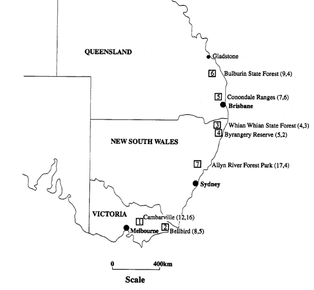

# ---------------------------
```{r echo=F}
chunk_options_df <- data.frame(
  Option = c("echo=TRUE (default)", "echo=FALSE", "eval=FALSE", "include=FALSE", 'results="hide"'),
  Code_Displayed = c("Yes", "No", "Yes", "No", "Yes"),
  Code_Executed = c("Yes", "Yes", "No", "Yes", "Yes"),
  Output_Shown = c("Yes", "Yes", "No", "No", "No")
)

# Convert to flextable
chunk_options_ft <- flextable(chunk_options_df) |>
  set_header_labels(
    Option = "Option",
    Code_Displayed = "Code Displayed?",
    Code_Executed = "Code Executed?",
    Output_Shown = "Output Shown?"
  ) |>
  theme_vanilla() |> 
  autofit()
chunk_options_ft
```


## Description

```{r possum-map, echo=FALSE, out.width="70%", fig.align='center'}
  # Load data-set and visualise
  

```


\newpage 
## 1. Data Loading

The data was loaded via a common function  load_datasets() ` used to load all data from  ../data/dataset.zip . See Appendix for the description. The data used for these questions is as follows: 
```{r format-possums,   eval=T}
pskim_ft = skim_flextable(possums)
pskim_ft
```


Plotting age vs Total Length (totlngth)

```{r possum-scatterplot1, eval=T}
# visualise age vs totlnght
# assuming length is in mm and age is in years
#
pPlot_age_v_lngth <- ggplot(possums, aes(x = totlngth, y = age)) +
  geom_point(color = "blue", alpha = 0.6) +  # Scatter plot with transparency
  geom_smooth(method = "lm", color = "red", se = FALSE) +  # Linear regression line
  xlim(73, 96) +  # Set x-axis limits
  xlab("Total Length (mm)") +
  ylab("Age (years)") +
  theme_minimal()
```

```{r format-possum-scatter, include=F}
ggsave("possum-scatter-plot.png", pPlot_age_v_lngth, width = 6, height = 4, dpi = 300)  # Adjust width & height

pPlot_age_v_lngth <- "
\\begin{figure}[H]
    \\centering
    \\begin{minipage}{0.5\\textwidth}  % Set to 50% of page width
        \\centering
        \\includegraphics[width=\\textwidth]{possum-scatter-plot.png}
        \\caption{Age vs. Total Length}
    \\end{minipage}
\\end{figure}
"

```
\newpage
An initial scatter plot shows  the raw data directly from the CSV file. It is a plot of age (years) vs total body length (mm) of the possums.

```{r possum-scatterplot2, eval=T}
knitr::asis_output(pPlot_age_v_lngth)
```

There is a **weak positive correlation**  seen by the regression line. This suggests a weak relationship that as total length increases, the age  increases. There is a **high degree of variability** that goes against the regression line -  some younger possums have large total lengths, and some older ones have shorter total lengths.

Additionally, the data points are widely spread, particularly at higher total lengths, suggesting that total length alone is not be a strong predictor of age. There is a high density of points is between 80–95 mm in total length. There is a high density of points between 1–6 years in age. This indicates that most possums fall within this range. 

\newpage
```{r possum-boxplots1 , eval=T}
pbox_age <- ggplot(possums, aes(x = "", y = age)) + 
  geom_boxplot(fill = "lightblue", outlier.colour = "red", outlier.shape = 16, outlier.size = 3) + 
  labs(title = "Box Plot of Age (Years)", y = "Age (Years)", x = "") + 
  theme_minimal()

# Create Boxplot for Total Length

pbox_lngth <- ggplot(possums, aes(x = "", y = totlngth)) + 
  geom_boxplot(fill = "lightgreen", outlier.colour = "red", outlier.shape = 16, outlier.size = 3) + 
  labs(title = "Box Plot of Total Length (mm)", y = "Total Length (mm)", x = "") + 
  theme_minimal()

```

```{r format-boxplot1, include=F}

ggsave("boxplot_age.png", plot = pbox_age,   width = 3, height = 4)
ggsave("pbox_lngth.png",  plot = pbox_lngth, width = 3, height = 4)

pboxes <- "
\\begin{figure}[htbp]
    \\centering
    \\makebox[0.65\\textwidth]{  % Adjust overall width
  
        \\begin{minipage}[t]{0.30\\textwidth}
            \\centering
            \\includegraphics[width=\\textwidth]{boxplot_age.png}   \
            \\caption{Age}
        \\end{minipage}
        \\hspace{10pt}  % Adjust horizontal spacing
        \\begin{minipage}[t]{0.30\\textwidth}
            \\centering
            \\includegraphics[width=\\textwidth]{pbox_lngth.png}
            \\caption{Total Length}
        \\end{minipage}
    }
\\end{figure}
"

```

```{r , eval=T}
knitr::asis_output(pboxes)
```


Outliers are present, particularly possums older than 5 years, which will require further examination.

The data is raw and unprocessed. Inconsistencies and/or these outliers may be affecting the results. Additional Data cleaning and Analysis is required. As this is only one predictor. Others win need to be explored to build a model that will confidently predict age. 


### 2a. Dropping Unnecessary Columns
Two columns (**case**, **Pop**) were dropped as instructed. **case** was a numerical reference that is not needed in our model; **Pop** was redundant with **site**. 

### 2b. and 2c. Convert Categorical Columns

The categorical data (**sex**, **site**) were changed to an appropriate format as
instructed: **sex** was converted to binary (`female = 1, male = 0`). 
**site** was One-hot encoded and the column for factor 7 was dropped to avoid 
multicollinearity. 

In preperation for splitting the data and ensuring stratification, missing data in age is imputing with `mice(method = "pmm")` which provide a predictive mean matching method. 
We imputed the data rather than removed it due to the small number of data rows and the large number of predictors. In particular, **age** could not be left with `NA`.


```{r possums-convert1 , eval=T}
set.seed(82171165) 

#  drop case - as this is just a numeric row index
#  drop Pop - it is redundant as we have site. 
#
possums_0 <- subset(possums, select = -c(case, Pop))           # drop case and Pop

#  impute with predictive mean matching finds the closest observed values 
#  in the dataset and randomly selects one to impute the missing value.
#
possums_0 <- mice(possums_0, m=1, method="pmm") |> complete()  # impute

# One-hot encode site: Convert site  into six binary variables (site1 to  site6). 
# site7  is not needed due to the "dummy variable trap".    
#
possums_0$site       <- as.factor(possums_0$site)                       # factor 
ps_dummies           <- model.matrix(~ site - 1, data = possums_0)      # get 7 site columns
psite_7              <- levels(possums_0$site)[7]                       # get factor 7
pcols_2_keep         <- colnames(ps_dummies) != paste0("site", psite_7) # boolean arguments
ps_dummies           <- ps_dummies[, pcols_2_keep]              # remove site7
colnames(ps_dummies) <- paste0("site", levels(possums_0$site)[-7])      # add names
possums_1            <- cbind(possums_0, ps_dummies)                    # combine with dummies
possums_1$site       <- NULL    # remove categorical              

# mutate sex to numberic where female = 1
#
possums_1$sex <- as.numeric(possums_0$sex == "f")            #  true if female

# relocate age to last for analysis 
#
possums_1       <- possums_1 |> relocate(age, .after = last_col()) 
psite_names     <- grep("^site", names(possums_1), value = TRUE)
pdummy_names    <- c(psite_names, "sex")
pdummies        <- possums_1 |> select(pdummy_names)
pnumerics       <- possums_1 |> select(-all_of(pdummy_names))
pnumeric_names  <- pnumerics |> names()
```
\newpage

```{r format-comparison , include=F}
new_colnames <- c( # from assignment
  "sex (female=1)", "head length", "skull length", "body length", 
  "tail length", "foot length", "ear conch length", "eye size", 
  "chest girth", "belly girth", "site1", "site2", "site3", "site4", 
  "site5", "site6", "age (years)"
)

# from image 
possums_1_display <- possums_1
colnames(possums_1_display) <- new_colnames

possums_1_display <- possums_1_display %>%
  rename(
    Cambarville                = site1,
    Bellbird                   = site2,
    `Whian Whian State Forest` = site3,
    `Byrangery Reserve`        = site4,
    `Conondale Ranges`         = site5,
    `Bulburin State Forest`    = site6
  )


# Check new column names
colnames(possums_1_display)


# Create the flextable
pskim_ft1 <- skim_flextable(possums_1_display,2.0)

# Save as an image
save_as_image(pskim_ft1, path = "pskim_ft1.png")
save_as_image(pskim_ft,  path = "pskim_ft.png")
file.exists("pskim_ft.png")
file.exists("pskim_ft1.png")
pcompare_tables <- "
\\begin{figure}[htbp]
    \\centering
    \\begin{minipage}[t]{0.45\\textwidth}
        \\centering
        \\includegraphics[height=9cm]{pskim_ft.png}
        \\captionof{figure}{\\texttt{possums.csv}}
    \\end{minipage}
    \\hfill
    \\begin{minipage}[t]{0.45\\textwidth}
        \\centering
        \\includegraphics[height=9cm]{pskim_ft1.png}
        \\captionof{figure}{\\texttt{possums\\_1}}
    \\end{minipage}
\\end{figure}
"

```


```{r print-tables, eval=T}
knitr::asis_output(pcompare_tables)

```


We begin the Exploratory Data Analysis on the cleaned dataset. This is to better understand the distribution and characteristics of its features. The table below is the key summary statistics, and includes the mean, median, minimum, maximum, and interquartile range (IQR) for each variable. 


Search


ChatGPT can make mistakes. OpenAI doesn't use Industrial Origami Limited workspace data to train its models.
?


```{r possum-summary-stats, eval=T}
# Compute summary statistics for all numeric features
possum_summary <- possums_1  |>
  select(where(is.numeric)) |>
  summarise(
    across(
      everything(), 
      .fns = list(
        Mean = \(x) mean(x, na.rm = TRUE), 
        Median = \(x) median(x, na.rm = TRUE), 
        Min = \(x) min(x, na.rm = TRUE), 
        Max = \(x) max(x, na.rm = TRUE), 
        IQR = \(x) IQR(x, na.rm = TRUE)
      )
    )
  )

# Reshape the summary statistics into a tidy format
possum_summary <- possum_summary |>
  pivot_longer(cols = everything(), names_to = c("Variable", ".value"), names_sep = "_")
```


```{r possum-summary-table, include=F}
# Convert to a flextable for better display
possum_summary <- possum_summary |> 
  mutate(Mean = round(Mean, 2))

# Convert to a flextable for better display
possum_summary_ft <- flextable(possum_summary) |>
  set_header_labels(
    Variable = "Feature",
    Mean     = "Mean",
    Median   = "Median",
    Min      = "Min",
    Max      = "Max",
    IQR      = "Interquartile Range"
  ) |>
  theme_vanilla() |>
  width(j = 1, width = 1) |>  # Manually set column widths
  width(j = 2:6, width = 1)   # Adjust other columns


```


```{r possum-summary-table2, eval=T}
possum_summary_ft
```

the distribution of numerical features is seen with histograms.  By examining histograms, we can see if the data includes histogr extreme values skewnes or outliers.  we can determin whether transformationsto improve normality and performance.


```{r possum-histograms, eval=T}

# Select only numeric features excluding one-hot encoded variables and sex
possums_long_col <- pivot_longer(pnumerics,
                                 cols = all_of(pnumeric_names), 
                                 names_to = "Variable", 
                                 values_to = "Value") |> drop_na(Value) 

# Create histogram and density plots
#
phistograms <- ggplot(possums_long_col, aes(x = Value)) +
  geom_histogram(aes(y = after_stat(density)), bins = 30, fill = "lightblue", color = "black", alpha = 0.7) +
  geom_density(color = "red", linewidth = 1) +  # Overlay density curve
  facet_wrap(~ Variable, scales = "free", ncol = 3) +  # Facet by variable
  theme_minimal() +
  labs(title = "Histograms and Density Plots of Numeric Features (Excluding One-Hot Variables and Sex)",
       x = "Value",
       y = "Density")

# Print plot
phistograms
```
The histograms and density plots illustrate the distribution of numeric features in the dataset, excluding one-hot encoded categorical variables:
 - variables, such as belly, , and skullw, exhibit approximately normal distributions
 - earcconch footlngth tail and totallngth have a bimodal compoent
 - totlngth, and taill, display notable deviations from normality. 
 - The age distribution is right-skewed, with a higher concentration of values at the lower end . 
 - totlngth and taill exhibit slight skewness and potential multimodality, 

 The variability in density patterns suggests that some features will require standardisation/scaling to ensure comparability when used. 
 
 
 
 we will now assess correlations between numerical features. Strong correlations between predictors can indicate multicollinearity,  distort regression coefficients,  and reduce model. reliability. 

When analysing the relationships between numerical predictors, it is important to determine whether the correlations differ depending on sex. By first filtering the dataset into subsets for males and females separately, we can compute distinct correlation matrices for each group. This approach allows us to identify whether the strength and direction of relationships between variables vary based on sex, which could influence the final model selection and interpretation.

Despite this filtering, the correlation calculation itself is performed without including sex as a variable. The correlation matrix is generated using only the continuous numerical predictors, ensuring that the analysis remains focused on the underlying relationships between these features. This decision is made to avoid introducing unnecessary categorical influences into a metric designed specifically for continuous data.

Once the correlation matrix is created for each subset, it is converted into a long format. This transformation simplifies the process of identifying highly correlated predictor pairs and allows for easier filtering and visualisation. While the long-format table itself does not explicitly track which subset (male, female, or full dataset) the correlations were derived from, maintaining separate outputs for each ensures clarity in analysis.

This structured approach ensures that we can compare correlations across sexes while keeping the analysis streamlined and focused on numerical relationships. It also helps in detecting potential multicollinearity issues within each subset, which is crucial for building a robust predictive model.

The correlation matix is augmented with a heatmap d to provide a clear visual representation of these relationships. 
 


```{r possum-correlation, eval=T}
# Select only numeric features excluding one-hot variables and sex

p_matrix1 <- cor(pnumerics, use = "pairwise.complete.obs")

# Convert correlation matrix to long format for better visualization
correlation_long <- as.data.frame(p_matrix1) |>
  rownames_to_column(var = "Variable1") |>
  pivot_longer(cols = -Variable1, names_to = "Variable2", values_to = "Correlation")

# Identify highly correlated predictor pairs (|correlation| > 0.8)
high_correlation <- correlation_long |>
  filter(abs(Correlation) > 0.8 & Variable1 != Variable2)

# Print highly correlated predictors
print(high_correlation)

# Keep only the lower triangle (e.g. Variable1 >= Variable2) of the correlation matrix
to_keep <- rowwise(correlation_long) |>  filter(Variable1 >= Variable2)

# heatmap of to_keep
p_correlation_heatmap <- ggplot(to_keep, aes(x = Variable1, y = Variable2, fill = Correlation)) +
  geom_tile(color = "white") +
  geom_text(aes(label = round(Correlation, 2)), color = "black", size = 3) +  # Show numeric values
  scale_fill_gradient2(low = "blue", mid = "white", high = "red", midpoint = 0) +
  theme_minimal() +
  labs(title = "Lower Triangle Correlation Matrix\nof All Data (Ignoring Sex)", fill = "Correlation") +
  theme(axis.text.x = element_text(angle = 45, hjust = 1))

# Print heatmap
p_correlation_heatmap
```


```{r possum-scatterplots, eval=T}
# Use pnumeric_names, which already excludes one-hot columns and sex
<<<<<<< HEAD
possums_long_scatter <- pivot_longer(pnumerics,
                                     cols = all_of(pnumeric_names),
                                     names_to = "Predictor",
                                     values_to = "Value") |>  
  mutate(age = rep(possums_1$age,
                   length(pnumeric_names))) |>  # Restore 'age' column
=======
possums_long_scatter <- pnumerics |>
  pivot_longer(cols = all_of(pnumeric_names), names_to = "Predictor", values_to = "Value") |>  
  mutate(age = rep(possums_1$age, length(pnumeric_names))) |>  # Restore 'age' column
>>>>>>> 5f8b1e2c91037974eae427ad625e97d3222d5182
  drop_na(Value, age)  # Remove missing values

#possums_long_scatter <- possums_1 |>
#  pivot_longer(cols = all_of(pnumeric_names), names_to = "Predictor", values_to = "Value") |>  
#  mutate(age = rep(possums_1$age, length(pnumeric_names))) |>  # Restore 'age' column
#  drop_na(Value, age)  # Remove missing values

# Confirm 'age' exists
print(colnames(possums_long_scatter))  # Debugging step
print(head(possums_long_scatter))  # Debugging step

# Create scatterplot with facets for different predictors
p_scatterplots <- ggplot(possums_long_scatter, aes(x = Value, y = age)) +
  geom_point(alpha = 0.6) +  # Scatter points
  geom_smooth(method = "lm", se = FALSE, color = "black", linewidth = 1) +  # Regression line
  facet_wrap(~ Predictor, scales = "free", ncol = 3) +  # Facet by predictor
  labs(title = "Scatterplots of Age vs Numeric Predictors",
       x = "Predictor Value",
       y = "Age (Years)") +
  theme_minimal()

# Print plot
p_scatterplots

```


### 2d. Data Splitting for Training, Testing, and Validation

The dataset is split with a focus on stratification with 80% Training 
(**possum_2**), 10% Test(**pTestDf**), used to evaluate models, and 
10% Validation (**pValidateDf**), used for final model selection and assessment

```{r possum-data-splitting , eval=T}

# data-splitting is performed before cleaning predictors 
# to simulate real-world events. 
# 
pTrainIdx <- createDataPartition(possums_1$age, p = 0.8, list = FALSE)
possums_2 <- possums_1[pTrainIdx, ]

# pTestDf     is the test possum data       (with stratification)
# pValidateDf is the validation possum data (with stratification) 
#
pTempDf     <- possums_1[-pTrainIdx, ]  #not train
pTestIdx    <- createDataPartition(pTempDf$age, p = 0.5, list = FALSE) 
pTestDf     <- pTempDf[pTestIdx, ]   
pValidateDf <- pTempDf[-pTestIdx, ]

```

```{r format-split, eval=T}
total_rows <- nrow(possums_1)

#  dataframe
#
psplit_df <- data.frame(
  Dataset = c("possums_2", "pTestDf", "pValidateDf"),
  `pctExpected` = c(80, 10, 10),
  `xExpected`   = c(total_rows * 0.8, total_rows * 0.1, total_rows * 0.1),
  `xActual`     = c(nrow(possums_2), nrow(pTestDf), nrow(pValidateDf))  # Actual values from your dataset
   )

# flextable
#
psplit_ft <- flextable(psplit_df) |> 
  set_header_labels(
     Dataset      = "Dataset",
    `pctExpected` = "Percentage",
    `xExpected`   = "Calculate Rows",
    `xActual`     = "Actual Rows"
  ) |> 
  autofit() |>  # fit the content
  width(j = 1, width = .8) |>           # Dataset 
  width(j = 2:4, width = 0.8) |>        # other columns
  set_table_properties(width = 0.3) |>  #  overall  width
  autofit()  # fit the widths setting

```

While stratification helps maintain representative samples, the constraints of whole-number rows and maintaining class balance mean that the exact number of rows in each split may differ slightly from expected percentages. This explains why possums_2, pTestDf, and pValidateDf did not match the precise 80-10-10 split but were close enough to maintain the stratified structure.

```{r print-split, eval=T}
knitr::knit_print(psplit_ft, output_format = "latex")
```

```{r possum-correlation-grouped1, eval=FALSE}
#
# THIS CHUNK IS USED?
#
#
#


# Function to generate correlation matrix and heatmap for a subset
generate_correlation_heatmap <- function(subset_name, subset_data) {
  # Select only numeric features excluding one-hot variables and sex
  

  # Compute Pearson correlation matrix
  p_matrix <- cor(pnumerics, use = "pairwise.complete.obs")

  # Convert correlation matrix to long format for better visualization
  correlation_long <- as.data.frame(p_matrix) |>
    rownames_to_column(var = "Variable1") |>
    pivot_longer(cols = -Variable1, names_to = "Variable2", values_to = "Correlation")

  # Identify highly correlated predictor pairs (|correlation| > 0.8)
  high_correlation <- correlation_long |>
    filter(abs(Correlation) > 0.8 & Variable1 != Variable2)

  # Print highly correlated predictors
  print(paste("Highly correlated predictors for", subset_name))
  print(high_correlation)

  # Keep only the lower triangle of the correlation matrix
  to_keep <- correlation_long |> 
    rowwise() |> 
    filter(Variable1 >= Variable2)

  # Create a correlation heatmap with numeric values on the diagonal
  p_correlation_heatmap <- ggplot(to_keep, aes(x = Variable1, y = Variable2, fill = Correlation)) +
    geom_tile(color = "white") +
    geom_text(aes(label = round(Correlation, 2)), color = "black", size = 3) +  # Show numeric values
    scale_fill_gradient2(low = "blue", mid = "white", high = "red", midpoint = 0) +
    theme_minimal() +
    labs(title = paste("Correlation Matrix Heatmap for", subset_name), fill = "Correlation") +
    theme(axis.text.x = element_text(angle = 45, hjust = 1))

  # Print heatmap
  print(p_correlation_heatmap)
}

# Loop through each one-hot site variable and sex
for (cat_var in pdummy_names) {
  unique_vals <- unique(possums_1[[cat_var]])  # Unique values (0 or 1 for one-hot, 0/1 for sex)
  
  for (val in unique_vals) {
    subset_name <- paste(cat_var, "=", val)  # Create name for subset
    subset_data <- possums_1 |> filter(!!sym(cat_var) == val)  # Filter dataset
    
    # Ensure sufficient data points before computing correlation
    if (nrow(subset_data) > 5) {
      generate_correlation_heatmap(subset_name, subset_data)
    } else {
      print(paste("Skipping", subset_name, "- Not enough data points"))
    }
  }
}
```

```{r ridge-regression, eval=T}
pridge_x <- as.matrix(possums_2 %>% select(-age))  # Exclude age 
pridge_y <- possums_2$age                          # Potential predictors

# Ridge Regression with Cross-Validation
pridge_cv   <- cv.glmnet(pridge_x, pridge_y, alpha = 0, nfolds = 10)   
plambda_min <- pridge_cv$lambda.min  # Best lambda

# Fit final Ridge model
pridge_model <- glmnet(pridge_x, pridge_y, alpha = 0, lambda = plambda_min) 
pridge_coeff <- coef(pridge_model)  

# Predict on validation set
pridge_x_val <- as.matrix(pValidateDf %>% select(-age))
pridge_pred  <- predict(pridge_model, newx = pridge_x_val) 

# Compute evaluation metrics
pridge_mse   <- mean((pValidateDf$age - pridge_pred)^2)   
pridge_rmse  <- sqrt(pridge_mse)  
pridge_mae   <- mean(abs(pValidateDf$age - pridge_pred))  
pridge_rse   <- summary(lm(age ~ ., data = possums_2))$sigma  
pridge_adjR2 <- summary(lm(age ~ ., data = possums_2))$adj.r.squared  
pridge_aic   <- AIC(lm(age ~ ., data = possums_2))  

# Convert Ridge Regression coefficients to dataframe
pridge_coeff_df <- as.data.frame(as.matrix(pridge_coeff))
colnames(pridge_coeff_df) <- "Coefficient"
pridge_coeff_df$Predictor <- rownames(pridge_coeff_df)
rownames(pridge_coeff_df) <- NULL

# Sort by importance (absolute value of coefficients) & keep top 10
pridge_coeff_df <- pridge_coeff_df %>%
  arrange(desc(abs(Coefficient))) %>%
  filter(Predictor != "(Intercept)") %>%
  head(10)


```


```{r ridge-model-evaluation, eval=T}
# Print Ridge Regression evaluation metrics
print(paste("Best Lambda for Ridge:", plambda_min))
print(paste("Ridge Regression MSE:", pridge_mse))
print(paste("Ridge Regression RMSE:", pridge_rmse))
print(paste("Ridge Regression MAE:", pridge_mae))
print(paste("Ridge Regression Residual Standard Error:", pridge_rse))
print(paste("Ridge Regression Adjusted R²:", pridge_adjR2))
print(paste("Ridge Regression AIC:", pridge_aic))

# Print the top 10 most important predictors based on Ridge coefficients
print("Top 10 Important Predictors (Ridge Regression):")
print(pridge_coeff_df)


```


```{r ridge-feature-selection, eval=T}
# Convert Ridge Regression coefficients to a dataframe
pridge_coeff_df <- as.data.frame(as.matrix(pridge_coeff))
colnames(pridge_coeff_df) <- "Coefficient"
pridge_coeff_df$Predictor <- rownames(pridge_coeff_df)
rownames(pridge_coeff_df) <- NULL

# Sort predictors by absolute coefficient values (most important first)
pridge_coeff_df <- pridge_coeff_df %>%
  arrange(desc(abs(Coefficient)))

# Remove the intercept term
pridge_coeff_df <- pridge_coeff_df %>% filter(Predictor != "(Intercept)")

# there are 16 possible features
#
num_features <- 16   
top_predictors <- pridge_coeff_df %>% head(num_features) %>% pull(Predictor)

# Construct the final model formula using selected features
ridge_selected_formula <- as.formula(paste("age ~", paste(top_predictors, collapse = " + ")))

# Fit the final linear model using Ridge-selected predictors
plm <- lm(ridge_selected_formula, data = possums_2)

# Print selected predictors
print(paste("Selected Predictors for Final Model:", paste(top_predictors, collapse = ", ")))


```


```{r possum-model-selection,     eval=F}

# Define all possible predictor combinations
#
#psite_cols <- grep("^site", names(possums_2), value = TRUE)

# Exclude age, sex, and one-hot encoded site variables
#
predictors  <- names(possums_2)[!names(possums_2) %in% c("age", "sex", psite_cols)]
predictors  <- names(possums_2)

# Perform best subset selection
#
possum_models <- regsubsets(age ~ ., data = possums_2, nvmax = 256)  # exhaustive but greedy


# Evaluate models on validation set
#
pmodel_summary     <- summary(possum_models)

# Select the best model based on BIC
pmodel_idx <- which.min(pmodel_summary$bic)  
pmodel_predictors <- names(which(pmodel_summary$which[pmodel_idx, ] == TRUE))[-1]

# Construct formula for best model
pmodel_formula <- as.formula(paste("age ~", paste(pmodel_predictors, collapse = " + ")))

# Fit the best model
plm <- lm(pmodel_formula, data = possums_2)

# Predictions on validation set
preds <- predict(plm, newdata = pValidateDf)

# Compute Additional Metrics
pMSE_validate  <- mean((pValidateDf$age - preds)^2)  # MSE
pRMSE_validate <- sqrt(pMSE_validate)  # RMSE
pMAE_validate  <- mae(pValidateDf$age, preds)  # MAE
pRSE           <- summary(plm)$sigma  # Residual Standard Error
pAdjR2         <- summary(plm)$adj.r.squared  # Adjusted R²
pAIC           <- AIC(plm)  # AIC Score

print(pMSE_validate)

```


```{r possum-model-selection2, results='asis', eval=F}
# Print Model Performance Metrics
metrics_df <- data.frame(
  Metric = c("MSE", "RMSE", "MAE", "Residual Std Error", "Adjusted R2", "AIC"),
  Value = unlist(c(pMSE_validate, pRMSE_validate, pMAE_validate, pRSE, pAdjR2, pAIC))
)

print(metrics_df)

# Print Model Coefficients
print("Model Coefficients:")
print(summary(plm)$coefficients)

# Convert subset selection results into a DataFrame
summary_mat <- as.data.frame(pmodel_summary$which)
colnames(summary_mat)[1] <- "Intercept"

# Replace TRUE/FALSE with symbols for better readability
summary_mat[summary_mat == TRUE] <- "T"
summary_mat[summary_mat == FALSE] <- ""

# Convert to flextable for better visualization
summary_ft <- flextable(summary_mat) |>
  set_table_properties(width = 0.9, layout = "autofit") |>
  theme_vanilla() |>
  bold(j = 1, bold = TRUE) |>
  align(align = "center", part = "all") |>
  border_outer(part = "all", border = officer::fp_border(color = "black", width = 1)) |>
  border_inner_h(border = officer::fp_border(color = "black", width = 0.5)) |>
  border_inner_v(border = officer::fp_border(color = "black", width = 0.5)) |>
  rotate(j = 1:ncol(summary_mat), rotation = "btlr", part = "header")

# Print table
summary_ft

```

we need to validate key regression assumptions:

1. Linearity & Homoscedasticity Check

Plot: Residuals vs. Fitted Values
Purpose: Ensures variance of residuals is constant (no funnel shape).

2.  Normality Check

Plot: QQ Plot of Residuals
Purpose: Checks if residuals follow a normal distribution.

3. Influential Points Check

Plot: Residuals vs. Leverage (Cook’s Distance)
Purpose: Detects high-leverage points that disproportionately affect the model.

```{r residual-analysis, eval=T}
# Compute residuals from the current linear model
residuals_df <- data.frame(
  Fitted = fitted(plm),
  Residuals = residuals(plm),
  Standardized_Residuals = rstandard(plm),
  Leverage = hatvalues(plm),
  CookD = cooks.distance(plm)
)

# 1️⃣ Residuals vs. Fitted Plot (Check Homoscedasticity)
p_residuals_vs_fitted <- ggplot(residuals_df, aes(x = Fitted, y = Residuals)) +
  geom_point(alpha = 0.6, color = "blue") +
  geom_hline(yintercept = 0, linetype = "dashed", color = "red") +
  labs(title = "Residuals vs. Fitted Values", x = "Fitted Values", y = "Residuals") +
  theme_minimal()

# 2️⃣ QQ Plot of Residuals (Check Normality)
p_qqplot <- ggplot(residuals_df, aes(sample = Standardized_Residuals)) +
  stat_qq() +
  stat_qq_line() +
  labs(title = "QQ Plot of Residuals", x = "Theoretical Quantiles", y = "Standardized Residuals") +
  theme_minimal()

# 3️⃣ Residuals vs. Leverage Plot (Detect Influential Points)
p_leverage <- ggplot(residuals_df, aes(x = Leverage, y = Standardized_Residuals, size = CookD)) +
  geom_point(alpha = 0.6, color = "purple") +
  geom_hline(yintercept = c(-2, 2), linetype = "dashed", color = "red") +
  labs(title = "Residuals vs. Leverage", x = "Leverage", y = "Standardized Residuals", size = "Cook's Distance") +
  theme_minimal()
```


```{r residual-analysis1, eval=T}
# Print plots
print(p_residuals_vs_fitted)
```
 Residuals vs. Fitted Values Plot:

The residuals should be randomly scattered around zero without any clear pattern.
The plot shows some heteroscedasticity (variance of residuals appears to increase for larger fitted values).
There is a possible funnel shape, indicating that the variance may not be constant, violating homoscedasticity.
There are no extreme outliers, but some points seem to be slightly away from the main cluster.


```{r residual-analysis11, eval=T}
print(p_qqplot)
```

 QQ Plot of Residuals:

The QQ plot assesses normality of residuals.
The residuals mostly follow the theoretical quantiles, but some points deviate in the upper and lower extremes.
This suggests some non-normality, potentially indicating skewness or heavier tails than expected in a normal distribution.
```{r residual-analysis1111, eval=T}
print(p_leverage)
```
 Residuals vs. Leverage Plot:

This plot helps identify influential points using leverage and Cook’s Distance.
Most points have low leverage, meaning they don’t disproportionately influence the regression model.
A few points have higher leverage, but none seem to have extreme influence (Cook’s Distance > 0.5 is usually considered problematic).
The majority of standardized residuals fall within the acceptable range (-2 to 2), but some approach these limits.
\newpage 
```{r possum-model-selection21, eval=F}
# Print the formatted table
#summary_ft
```

Summary of Issues:
Homoscedasticity concern: Increasing spread of residuals at higher fitted values.
Slight normality issue: Some deviations at the extremes in the QQ plot.
No extreme influential points, but a few may warrant further inspection.


\newpage
## Feature Selection and Model Training
```{r, eval=T}


```

## Model Evaluation

```{r, eval=T}
# Residuals vs. Leverage plot shows potential high-leverage points, which may be influencing the model too much

# Compute evaluation metrics
```

## Further Exploration

```{r, eval=T}
# Additional analysis or research questions 
#[204]
```
